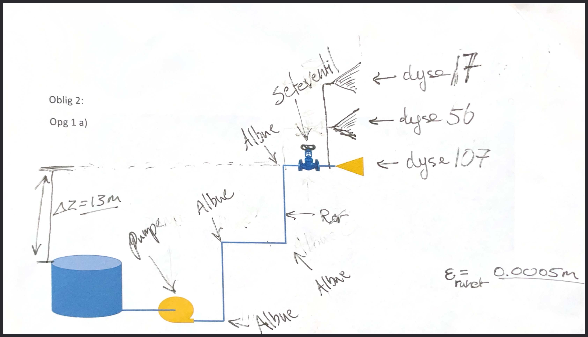
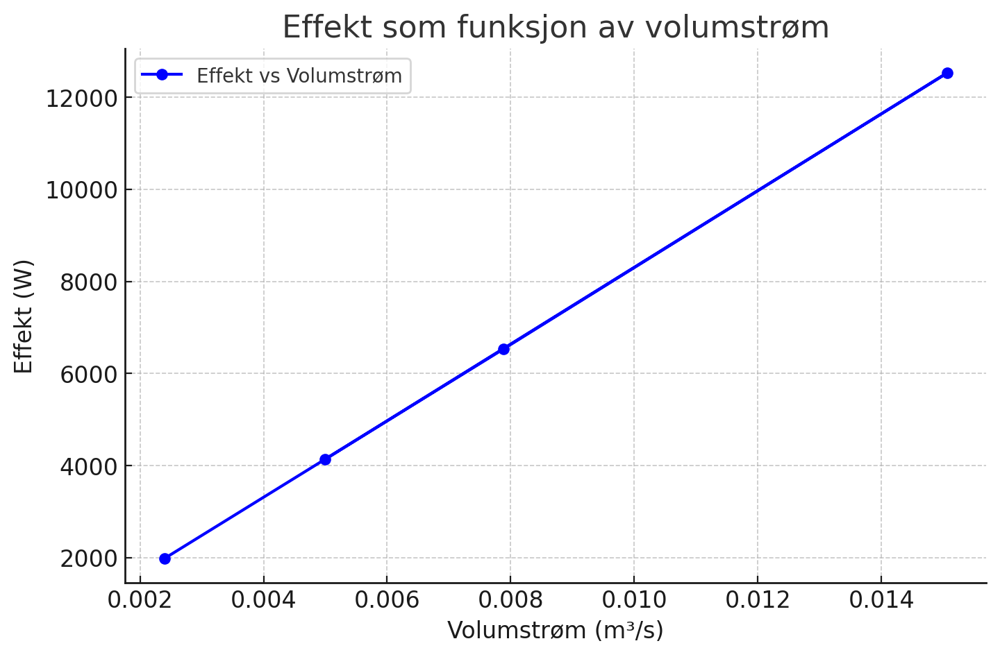
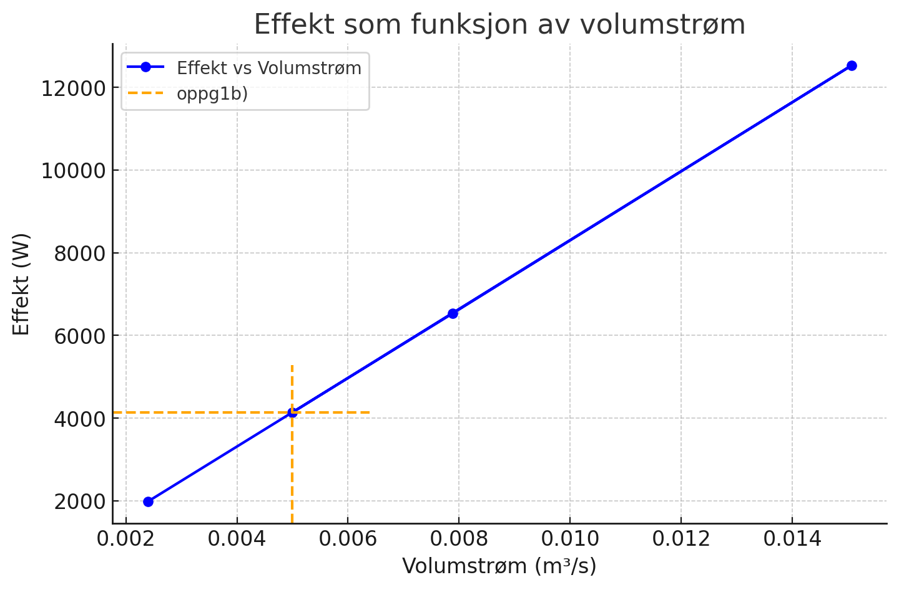
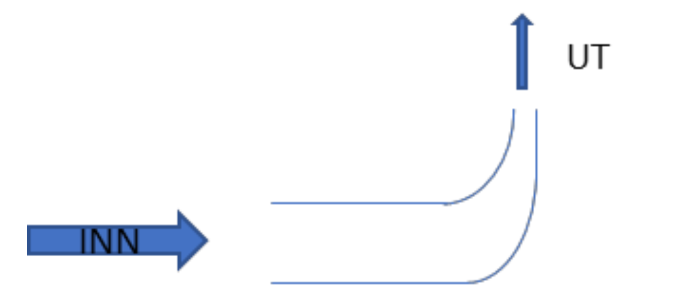
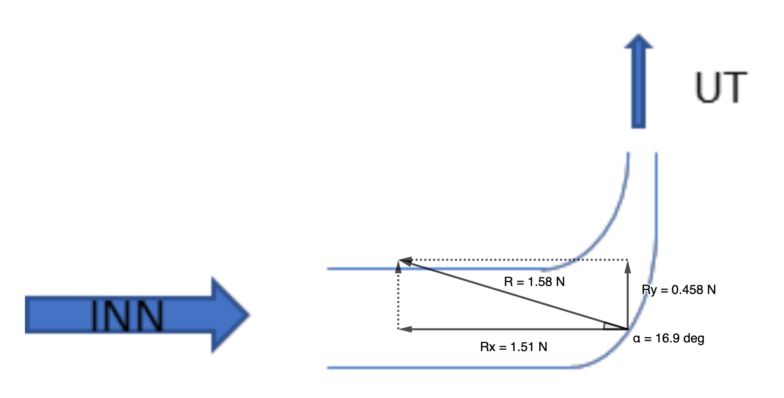

# TSM2450 Oblig 2

- Student: Jonas
- Emne: Termo- og fluidmekanikk
- Tid: Vår 2025 USN Porsgrunn
- Repo: [https://github.com/Arxcis/TSM2450-termo-og-fluid/oblig2](https://github.com/Arxcis/TSM2450-termo-og-fluid/tree/main/oblig2)

## Oppgave 1

### 1.1 Mål

Finne hvilket trykk, volumstrøm og effekt pumpen må ha, for tre dyser med ulike dysestrømningsfaktorer (K_dysestrømning) og konstant overtrykk.

### 1.2 Forutsetninger:

- K_dysestrømning: 17, 56, 107
- Ønsket overtrykk ved dyse: 7.0 bar
- Diameter på alle rør: 50mm
- Ruheten på alle rør: 0.50mm
- Lengde på alle rør: 50 meter
- Rørstrekket inneholder 4 albuer og 1 seteventil
  - K-faktor albue: 0.9 (fra tabell 10.2)
  - K-faktor seteventil: 10 (fra tabell 10.2)
- Trykket på toppen av tanken: 1atm eller 0 overtrykk
- Høydeforskjell mellom toppen av tank og dyse: 13 meter



### 1.3 Metode

1. Finner først volumstrømmen for en dyse med en gitt dysefaktor og gitt overtrykk.

$$
Q  [dm3/min] = K_{dyestrømning=17,56,107} \cdot \sqrt{7.0 [bar]}
$$

$$
Q  [m^3/s] = \frac{Q [dm^3/min]}{1000 \cdot 60}
$$

2. Finner deretter gjennomsnittshastigheten på vannet i røret.

$$
v_{snitt} [m/s] = \frac{Q [m^3/s]}{A_{rørtverrsnitt} [m^2]} = \frac{Q [m^3/s]}{\frac{\pi}{4} \cdot (D_{rør}[m])^2}
$$

3. hdyn regnes ut.

$$
h_{dyn} = \frac{v_{snitt}^2}{2 \cdot g}
$$

5. hf regnes ut for røret.

$$
hf_{rør} = f_{rør} \cdot \frac{L_{rør}}{D_{rør}} \cdot h_{dyn}
$$

7. h0 regnes ut for albue.

$$
h0_{albue} = 0.9 \cdot h_{dyn}
$$

8. h0 regnes ut for seteventil.

$$
h0_{sete} = 10 \cdot h_{dyn}
$$

9. Endelig brukes bernouli for å finne pumpehøyden (hp).

$$
hp = \Delta Z + \Delta h_{statisk} + \Delta h_{dynamisk} + hf_{rør} + h0_{sete} + 4 \cdot h0_{albue}
$$

```py
   hp_pumpemeter = ΔZ_forskjellmeter\
                 + Δhstat_statiskmeter\
                 + Δhdyn_dynamiskmeter\
                 + hf_rørtapmeter\
                 + h0_setetapmeter\
                 + h0_albuetapmeter * antall_albuer
```

10. Til slutt regnes effekten til pumpa som en funksjon av pumpehøyde (hp) og volumstrømmen (Q).

$$
P = \rho g Q h_{pumpe}
$$

### 1.4 Resultat

```sh
oppg1.py  oppg2.py  README.md
(.venv) jonas@pop-os:~/git/TSM2450-termo-og-fluid/oblig2$ python oppg1.py
dysefaktor:  [ 17  56 107]
volumstrøm:  [0.00239338 0.00788408 0.01506423 0.005     ] [m3/sekund]
volumstrøm:  [143.60297516 473.04509465 903.85402013 300.        ] [l/min]
pumpetrykk:  [8.27656552 8.28711457 8.31655435 8.28027217] [Bar]
effekt:  [ 1980.89905577  6533.63149159 12528.25180008  4140.13608357] [Watt]
```



### 1.5 Diskusjon oppg 1a)

Resultatet viser en tydelig lineær kobling mellom ønsket volumstrøm og påkrevd pumpeeffekt. Ved den minste volumstrømmen holder det med en pumpe som kan levere 2000 watt for å opprettholde 7 bar ved dyse. Under den høyeste volumstrømmen kreves en pumpe godt over 12 000 watt (!). Med andre ord, vil en 6-dobling i dysefaktor føre til en 6-dobling i volumstrømmen, som igjen vil føre til en 6-dobling i effektbehovet.

|            | min  | max    | max/min |
| ---------- | ---- | ------ | ------- |
| dysefaktor | 17   | 107    | 6.3x    |
| Q [l/min]  | 144  | 904    | 6.3x    |
| P [W]      | 1981 | 12 528 | 6.3x    |

### 1.6 Diskusjon oppg 1b)

I oppg1b) foreslår RMG-engineering en pumpe med volumstrøm på 0.005 [m3/s] og en pumpeeffekt på 3800 [Watt]. Om en plotter ønsket volumstrøm på den lineære modellen fra resultatet til oppg1a), ser man at pumpen ikke vil fungere da den er for svak. Q = 0.005 vil nemlig kreve over 4000 [Watt] fra pumpa for å kunne opprettholde ønsket trykk på 7.0bar ved dyse.



## Oppg2

### 2.1 Mål

Beregn kreftene på et kompressorbend som er en del av utløpet til en fontene.



### 2.2 Forutsetninger

- Ovetrykk inn (p_inn): 0.2 bar overtrykk
- Volumstrøm (Q): 0.4 liter per minutt.
- Rørdiameter inn (D_inn): 10mm
- Rørdiameter ut (D_ut): 3mm

### 2.3 Metode

```py

#
# Forutsetninger
#
rho_vann = 1000
Q_volumstrøm_dm3_min = 4.0
Q_volumstrøm = Q_volumstrøm_dm3_min / (1000*60)
p_inn = 0.2e5
D_inn = 10e-3
D_ut  = 3e-3

#
# Beregninger
#
from math import pi
A_inn = (pi/4)*D_inn**2
A_ut  = (pi/4)*D_ut**2

v_inn = Q_volumstrøm/A_inn
v_ut  = Q_volumstrøm/A_ut


# Bernouli / energiloven
"""
p_ut + p_dynamisk_ut = p_inn + p_dynamisk_inn
p_ut = p_inn + p_dynamisk_inn - p_dynamisk_ut
p_ut = p_inn + (rho/2)(v_inn^2 - v_ut^2)
"""
p_ut = p_inn + (rho_vann/2) * (v_inn**2 - v_ut**2)

# Newtons 2. og 3. lov
"""
sum(F) = m * a
        = kg * m/(s*s)
        = kg/s * m/s
        = kg/m3 * m3/s * m/s
        = rho   * Q    * v
sum(F) = F - Fmotkraft
    -p_inn*A_inn + Rx = rho * Q * (-v_inn)
    -p_ut*A_ut + Ry = rho * Q * (v_ut)
"""
Rx = rho_vann*Q_volumstrøm*(-v_inn) + p_inn*A_inn
Ry = rho_vann*Q_volumstrøm*(+v_ut) + p_ut*A_ut

from math import atan
α = (atan(Ry/Rx)/pi) * 180
```

### 2.4 Resultater

```out
$ python oppg2.py

        Q_liter          4 liter/min,
        v_inn        0.849 m/s,
        v_ut          9.43 m/s,
        p_inn        2e+04 Pa,
        p_ut     -2.41e+04 Pa,
        Rx            1.51 N,
        Ry           0.458 N,
        α             16.8 °,

```



### 2.5 Diskusjon

Trykket blir lavere ved utgangen enn ved inngangen til bendet. Det blir rett og slett et undertrykk på 0.24 Bar, eller -0.24 bar overtrykk. Dette undertrykket sørger for å redusere kraftbehovet som trengs i y-retning, fordi undertrykket skaper en sugekraft på resten av bendet som peker oppover.
